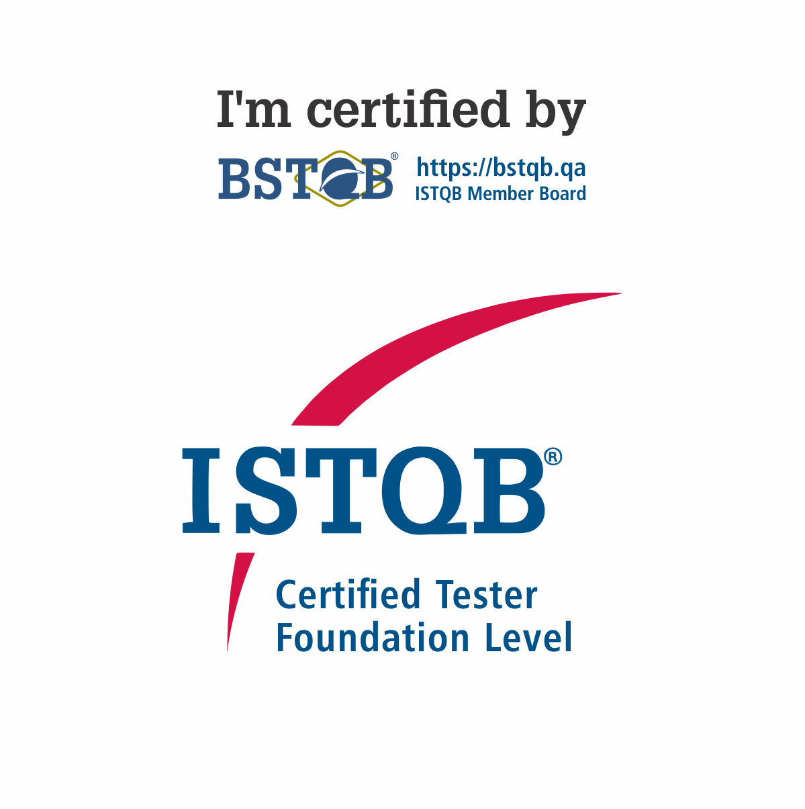
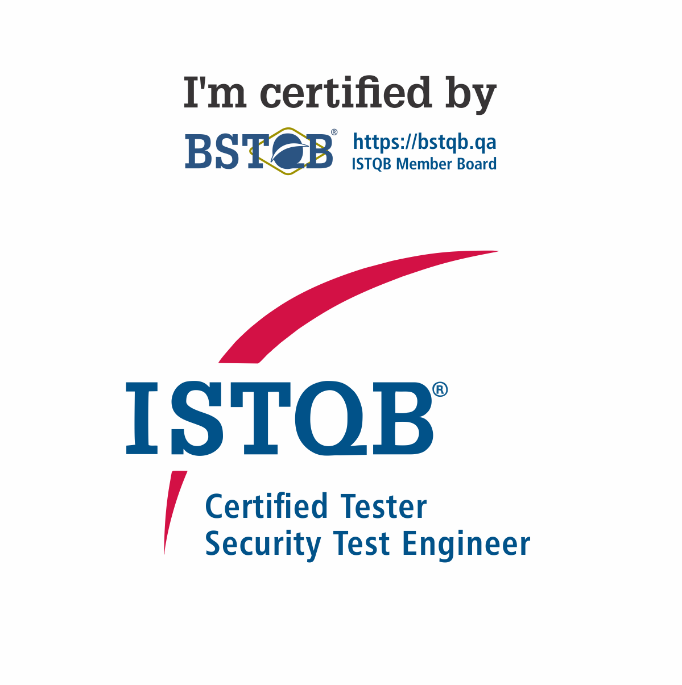

## Welcome, I'm Matheus Teodoro | FullStack Developer

Backend & Frontend Developer with **3+ years of software development experience**. I specialize in building scalable web applications using modern technologies like **ReactJS** and **Python**.

Currently a 4th-year Software Engineering student at **UNICV** – Maringá, PR, Brazil *(graduating December 2026)*.

---

### 🔗 Connect With Me

---

### 💻 Tech Stack

**Frontend:**
- ReactJS, Next.js, JavaScript
- Styling: Sass, CSS Modules, Tailwind CSS, Styled-Components, Bootstrap
- Responsive Design & CSS Architecture

**Backend:**
- Python
- Document Intelligence (OCR & automation with Microsoft Azure Document Intelligence)
- PostgreSQL Database Management
- RESTful API Development

**Other Skills:**
- HTML5, CSS3, Programming Logic
- Git Version Control & CI/CD
- Docker Containerization

---

### 🚀 Projects & Experience

**miinus.eco.br** *(Production Website Maintenance & Improvement)*
- Maintained and enhanced production website using React and Sass
- Strict adherence to Figma design specifications
- Full-stack improvements and optimization

---

### 🎓 Education & Certifications

**Software Engineering Degree**
- UNICV – Maringá, PR, Brazil
- Expected Graduation: **December 2026**

**International Certifications:**

 

---

### 🌍 Languages

- **Portuguese:** Native (Brazil)
- **English:** Intermediate (B1/B2)

  

